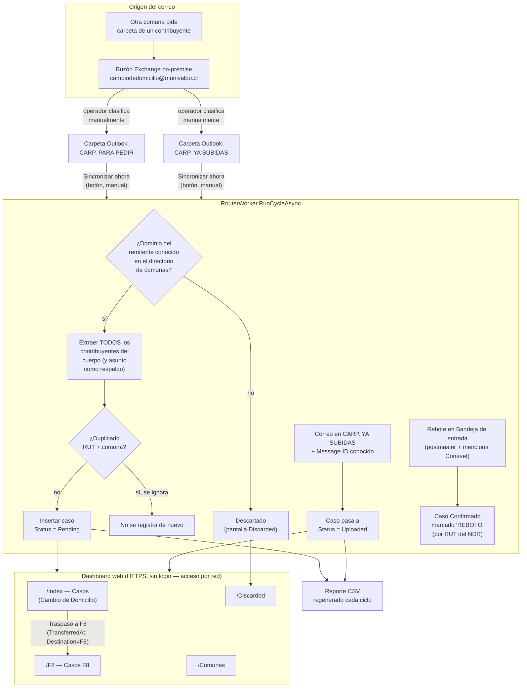
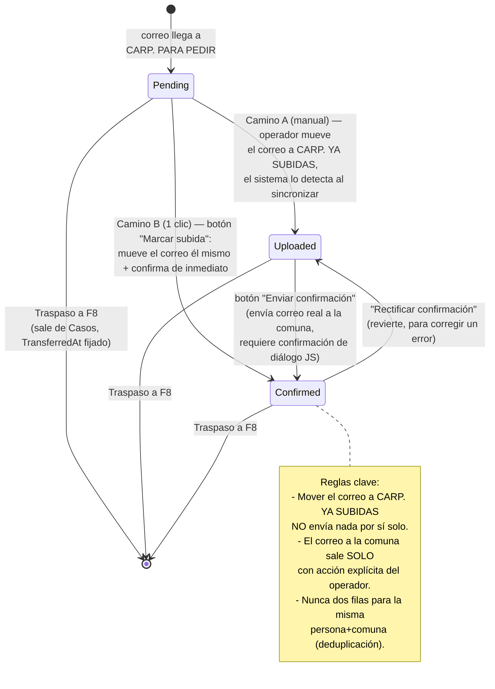
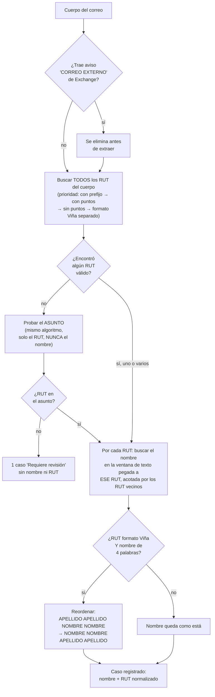
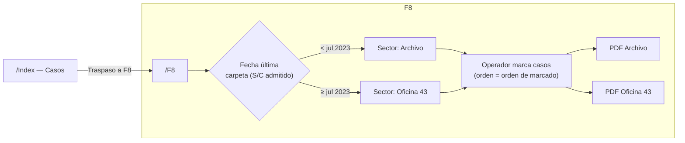
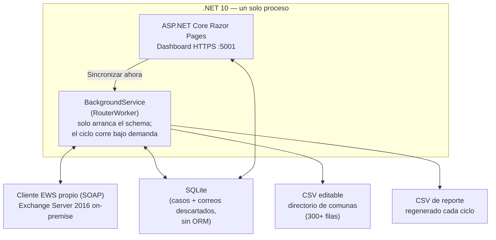
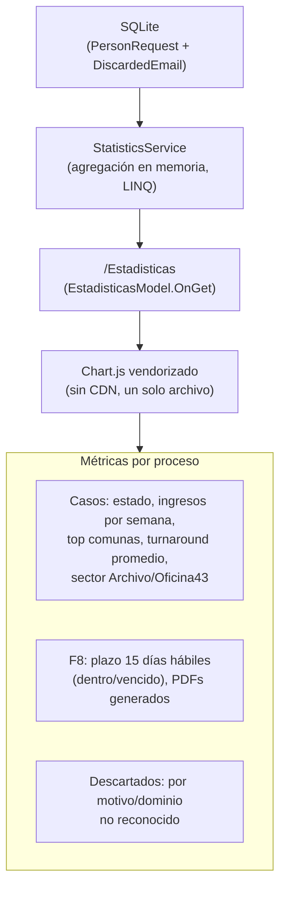

# Diagrama del sistema — CambioDeDomicilio

**Última actualización:** 2026-09-03
**Propósito:** referencia rápida para reportar el flujo del sistema (jefatura, auditoría, onboarding). Refleja el comportamiento real del código a esta fecha, no el diseño original.

> Nota de vigencia: el sondeo de correo **ya no es automático cada 30 min** — corre solo cuando el operador presiona "Sincronizar ahora" en el dashboard (`RouterWorker.RunCycleAsync`, disparado por `IndexModel.OnPostSyncNowAsync`). Otros documentos del proyecto (`reporte-tecnico.md`) todavía describen el sondeo periódico viejo; este diagrama es la versión actualizada.

## 1. Vista general del sistema

## 2. Ciclo de vida de un caso (Casos / Index)

## 3. Extracción de datos de un correo

**Por qué el nombre del asunto nunca se confía:** un correo real con asunto `Fwd: SUBIR CARPETA PLATAFORMA CONASET 14.148.466-4` (una instrucción, no un nombre) se registró una vez como si ese texto fuera el nombre del contribuyente. Desde entonces, el RUT del asunto se acepta como respaldo pero el nombre del asunto **jamás** — el caso siempre queda "Requiere revisión".

## 4. F8 — pista separada después del traspaso

## 5. Componentes técnicos

## 6. Estadísticas — pantalla de solo lectura (2026-07-28)

No agrega ningún paso al trámite — es una capa de reporte sobre datos que los otros procesos ya generan, sin escritura y sin cambio de schema.
